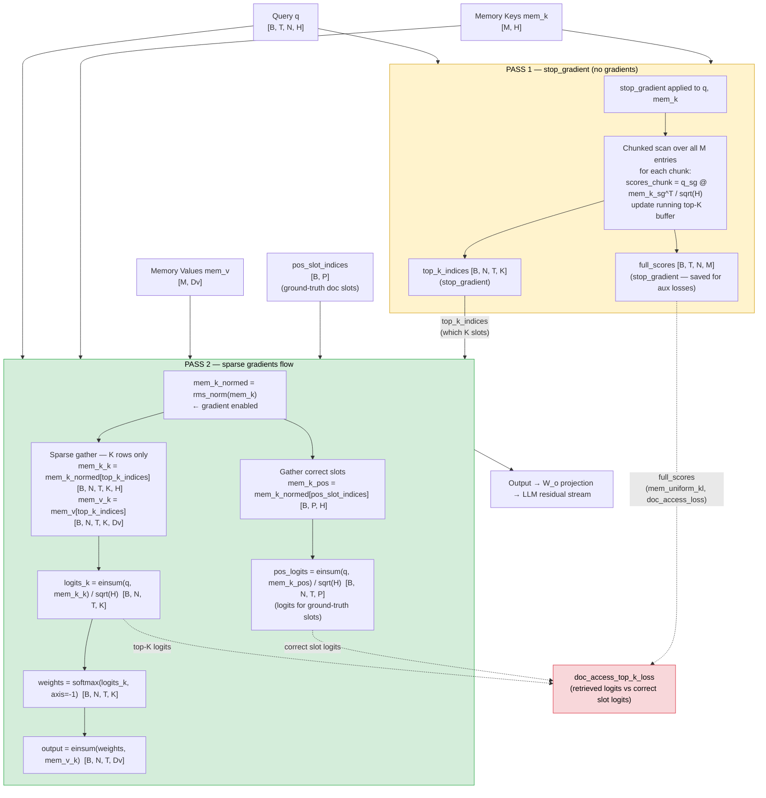

# Two-Pass Top-K Memory Retrieval

The two-pass method achieves gradient-efficient training over large memory banks. Instead of backpropagating through a full `[B, T, N, M]` score matrix (expensive when M is large), it identifies the top-K indices without gradients (Pass 1), then recomputes scores only for those K entries with gradients enabled (Pass 2).

## Gradient flow

| | Target |
|---|---|
| **Flows** | `q`, `mem_k` (K selected rows only), `mem_v` (K selected rows only) |
| **Blocked** | Index selection in Pass 1 (full `stop_gradient` boundary) |
| **Zero grad** | The M−K unselected memory entries |

## Why two passes?

**Naive single-pass:** `scores = q @ mem_k^T` produces a `[B, T, N, M]` matrix. Storing and differentiating through it is O(M) per example — prohibitive at M=16,384+.

**Two-pass:** Pass 1 identifies the K relevant entries cheaply (chunked, no gradient storage). Pass 2 differentiates through a `[B, T, N, K]` matrix. With K=128 and M=16,384, gradient memory is ~128× smaller.

## Approximation

The softmax in Pass 2 normalizes over K entries only, not all M. Weights differ slightly from `softmax(full_scores)[K_indices]`. The error is small when K is large (128 here) because the top-K entries dominate the probability mass.
